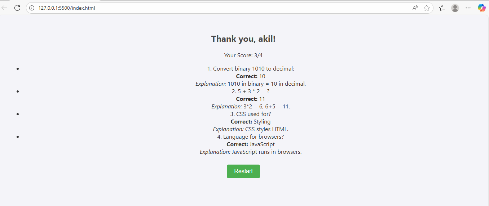
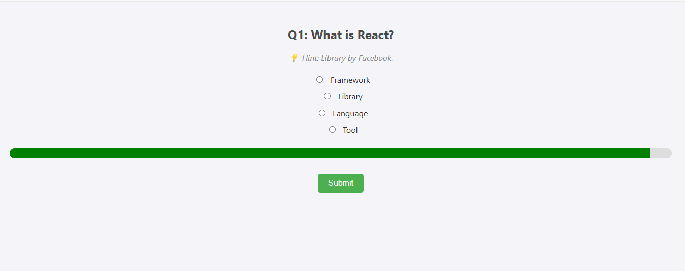
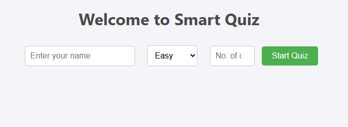
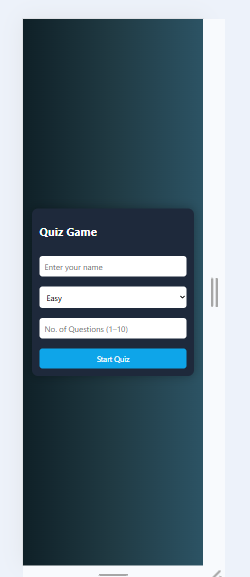

# Smart Quiz App

This is a simple interactive quiz project built using HTML, CSS, and JavaScript.

## Features
- Choose difficulty: Easy, Medium, Hard
- 1 to 10 questions per session
- Each question has:
  - Hint
  - Image (optional)
  - Explainer in result
- Progress bar with timer

## How to Run
1. Download and extract the folder.
2. Open `index.html` in a browser.
3. Enjoy the quiz!

---

Created with ❤️ by Akil Pathan 
